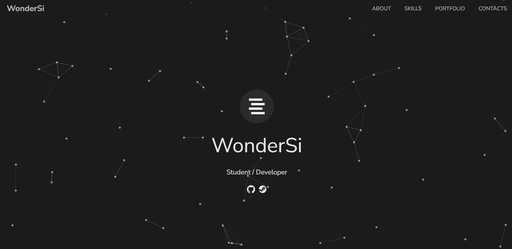
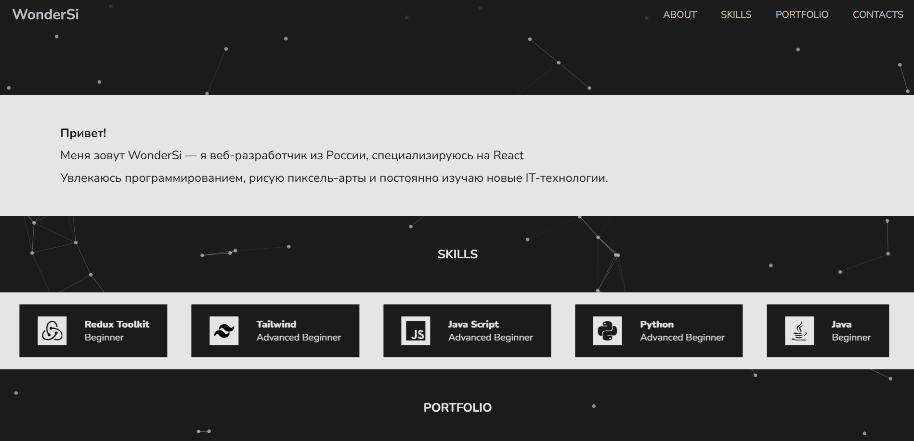
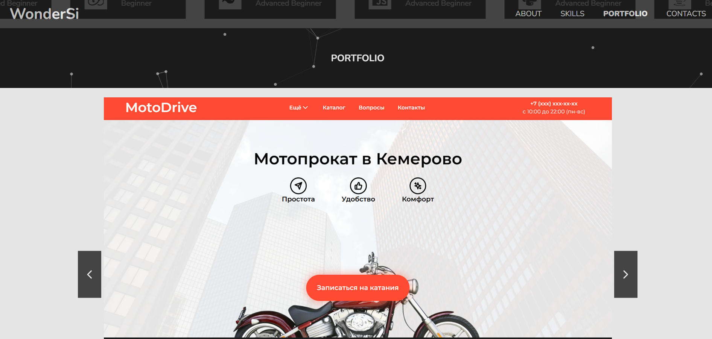
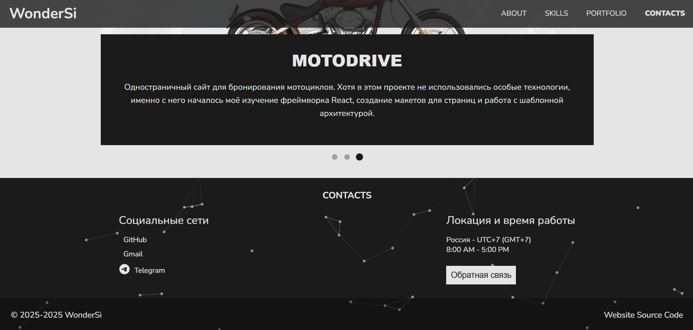
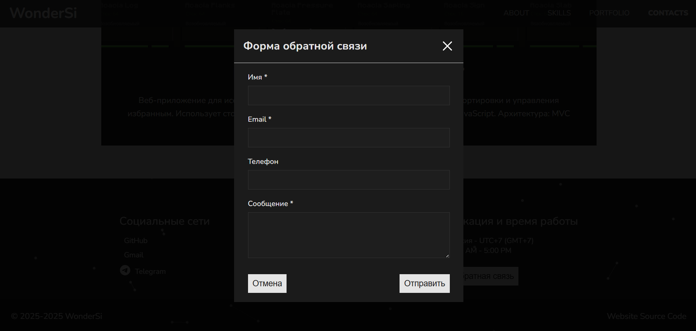
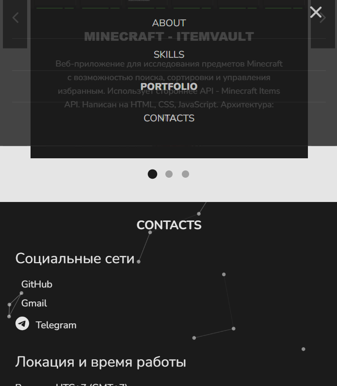
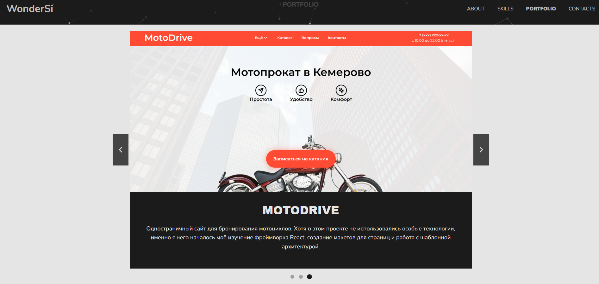
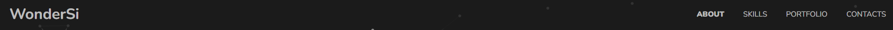

# 🎓 Лабораторная работа №2: Введение в jQuery — динамическое поведение страницы


## 📸 Скриншоты









## 🛠️ Технологии

- **Frontend**: HTML5, CSS3, JavaScript
- **Архитектура**:
```
lab2-portfolio-jquery/        <-- репозиторий
├─ index.html           # Главная страница
├─ css/
│  └─ styles.css        # Основные ситили
├── github/             # Файлы необходимые GitHub
├─ js/
│  └─ script.js         # js с использование jQuery
├─ data/
│  └─ portfolio.json    # Данные карточек портфолио
├── assets/
│ ├── images/           # Изображения 
│ └── fonts/            # Шрифты
├─ README.md
└─ .gitignore 
```

## Чек лист

✔️ **Подключена библиотека jQuery через CDN**
```
<script src="https://cdn.jsdelivr.net/npm/tsparticles-preset-links@2.12.0/tsparticles.preset.links.bundle.min.js" integrity="sha256-Kq9IblhtnUOu75DRD4BIgJ4p4/7JUMMy6eXI/YcTo0c=" crossorigin="anonymous" async="" defer="" onload="setupParticlesBackground()"></script>
```
---
✔️ **Реализована форма обратной связи с симуляцией отправки данных** <br/>
✔️ **Реализовано модальное окно** <br/>
✔️ **Валидация форм и полей ввода** <br/>


---
✔️ **Реализовано выпадающее меню** <br/>


---
✔️ **Карусель навыков или изображений работает с кнопками и автопрокруткой** <br/> 
✔️ **Галерея портфолио загружается из JSON** <br/>


---
✔️ **Подсветка активного пункта меню при скролле** <br/>
✔️ **Кнопка «Вверх» с плавным скроллом** <br/>
 <br/>
За ф-цию кнопки "Вверх" отвечает лого "WonderSi", а при скорлле страницы пункты меню имеют жирный стиль

---
✔️ **Корректная структура проекта (папки js/, data/, css/)**

---
✔️ **Применена хотя бы одна анимация** <br/>
Скрол страницы, карусель навыков и портфолио...

## Установка / Запуск

1. Клонируйте репозиторий:
```
git clone https://github.com/WonderSi/webdev-frontend-semestr5.git
```
2. Переключитесь на ветку `lab2-portfolio-jquery`:
```
git checkout lab2-portfolio-jquery
```
3. Откройте файл `index.html` в браузере:


