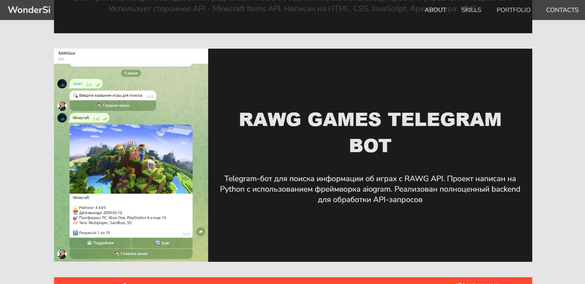

# 🎓 Лабораторная работа №1: Повторение HTML/CSS — статичная страница-визитка


## 📸 Скриншот




## 🛠️ Технологии

- **Frontend**: HTML5, CSS3, JavaScript ES6+
- **Архитектура**:
```
lab1-portfolio/
├── index.html    # Главная страница
├── css/
│ └── styles.css  # Основные стили
├── github/       # Файлы необходимые GitHub
├── assets/
│ ├── images/     # Изображения 
│ └── fonts/      # Шрифты
└── README.md   
```

## Установка / Запуск

1. Клонируйте репозиторий:
```
git clone https://github.com/WonderSi/webdev-frontend-semestr5.git
```
2. Переключитесь на ветку `lab1-portfolio`:
```
git checkout lab1-portfolio
```
3. Откройте файл `index.html` в браузере:
```
http://localhost:5500
```
